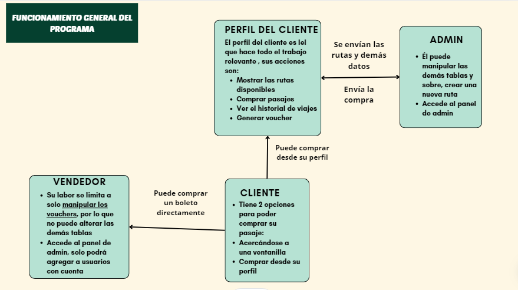

<div align="center">
<table>
    <theader>
        <tr>
            <td style="width:25%;"></td>
            <td>
                <span style="font-weight:bold;">UNIVERSIDAD NACIONAL DE SAN AGUSTIN</span><br />
                <span style="font-weight:bold;">FACULTAD DE INGENIERÍA DE PRODUCCIÓN Y SERVICIOS</span><br />
                <span style="font-weight:bold;">DEPARTAMENTO ACADÉMICO DE INGENIERÍA DE SISTEMAS E INFORMÁTICA</span><br />
                <span style="font-weight:bold;">ESCUELA PROFESIONAL DE INGENIERÍA DE SISTEMAS</span>
            </td>            
        </tr>
    </theader>
    <tbody>
        <tr>
        <td colspan="2"><span style="font-weight:bold;">Proyecto web</span>: Desarrollo de una aplicación web para la compra de pasajes de una empresa de viajes</td>
        </tr>
        <tr>
        <td colspan="2"><span style="font-weight:bold;">Fecha</span>:  2024/07/28</td>
        </tr>
    </tbody>
</table>
</div>

<div align="center">
<span style="font-weight:bold;">PROYECTO WEB</span><br />
</div>


<table>
<theader>
<tr><th>INFORMACIÓN BÁSICA</th></tr>
</theader>
<tbody>
    <tr>
        <td>ASIGNATURA:</td><td>Programación Web 2</td>
    </tr>
    <tr>
        <td>SEMESTRE:</td><td>III</td>
    </tr>
    <tr>
        <td>FECHA INICIO:</td><td>15-Jul-2024</td><td>FECHA FIN:</td>
        <td>29-Jul-2024</td><td>DURACIÓN:</td><td>04 horas</td>
    </tr>
    <tr>
        <td colspan="3">DOCENTES:
        <ul>
        <li>Richart Smith Escobedo Quispe - rescobedoq@unsa.edu.pe</li>
        </ul>
        </td>
        <td colspan="3">DESARROLLADORES:
        <ul>
        <li>Carlos CCamaque Wilson,</li>
        <li>Chura Acabana Julio rubén</li>
        <li>Del Castillo Montoya Christopher </li>
        <li>Quispe Flores Marco</li>
        </ul>
        </td>
    </<tr>
</tdbody>
</table>

#   WebApp con Django

<!-- [![License][license]][license-file] -->
<!-- [![Downloads][downloads]][releases]
[![Last Commit][last-commit]][releases] -->

[![Debian][Debian]][debian-site]
[![Git][Git]][git-site]
[![GitHub][GitHub]][github-site]
[![Vim][Vim]][vim-site]
[](https://vuejs.org/)
[](https://www.python.org/)


##  Tipo de Sistema
    Se trata de una aplicación web construida con el framework Django que permite realizar comprar en línea de pasajes de una empresa de viaje. La aplicación se centra básicamente en la facturación, por lo que aspectos como la elección del asiento o la programación automatizada de los viajes no es implementada de forma detallada

##  Requisitos del sistema
    El sistema debe satisfacer los siguientes requisitos funcionales y no funcionales:

    - RQ01 : El sistema debe permitir el inicio/cierre de sesión.
    - RQ02 : El sistema debe permitir la compra de pasajes mediante una plataforma de pagos real como Mercado pago
    - RQ03 : El sistema debe dar un voucher después de haber realizado la compra del pasaje
    - RQ04 : El sistema debe permitirle al cliente ver su historial de viajes

##  Modelo de datos
    El modelo de datos esta conformado por las siguientes entidades.

    -   Cliente : En esta entidad se almacena la información básica del cliente
    -   Conductor : En esta entidad se almacena los datos de los conductores disponibles que están disponibles
    -   Empresa: En este modelo se guarda la información sensible de la empresa
    -   Vehículo: En este modelo se guarda la información del trasnporte siendo el aforo uno de sus campos más relevantes
    -   Voucher: En este modelo se guarda la información de la compra. Este modelo relaciona las rutas con los clientes
    -   

    ...

##  Diccionario de datos

    En esta sección se presentarán los modelos utilizados 

### Cliente
| **Campos**       | **Tipo**           | **Descripción**                             |
|-----------------|---------------------|---------------------------------------------|
| `id`            | `BigAutoField`      | Clave primaria autoincremental.             |
| `Name`          | `CharField`         | Nombre del cliente.                         |
| `LastName`      | `CharField`         | Apellido del cliente.                       |
| `DNI`           | `IntegerField`      | Documento Nacional de Identidad.            |
| `Cellphone`     | `IntegerField`      | Número de teléfono celular.                 |
| `id_company`    | `ForeignKey`        | Clave foránea que refiere a la empresa.      |
| `created_at`    | `DateTimeField`     | Fecha y hora en que se creó el registro.    |
| `updated_at`    | `DateTimeField`     | Fecha y hora de la última actualización.    |
| `email`         | `EmailField`        | Correo electrónico del cliente.             |
| `password`      | `CharField`         | Contraseña del cliente (hasheada).          |


### Conductor

| **Atributo**   | **Tipo**         | **Nulo** | **Clave** | **Predeterminado** | **Descripción**                                  |
|----------------|-------------------|----------|-----------|--------------------|--------------------------------------------------|
| id             | BigAutoField      | No       | Sí        | Ninguno            | Clave primaria autoincremental.                 |
| name           | CharField         | No       | No        | Ninguno            | Nombre del conductor.                           |
| surName        | CharField         | No       | No        | Ninguno            | Apellido del conductor.                         |
| DNI            | IntegerField      | Sí       | No        | 0                  | Documento Nacional de Identidad.                |
| adress         | CharField         | No       | No        | Ninguno            | Dirección del conductor.                        |
| phoneNumber    | IntegerField      | Sí       | No        | 0                  | Número de teléfono del conductor.               |
| licenseType    | CharField         | No       | No        | Ninguno            | Tipo de licencia del conductor.                 |
| created_at     | DateTimeField     | No       | No        | Fecha actual       | Fecha y hora en que se creó el registro.        |
| updated_at     | DateTimeField     | No       | No        | Fecha actual       | Fecha y hora de la última actualización.        |

### Empresa

| **Atributo** | **Tipo**        | **Nulo** | **Clave** | **Predeterminado** | **Descripción**                                  |
|--------------|------------------|----------|-----------|--------------------|--------------------------------------------------|
| id           | BigAutoField     | No       | Sí        | Ninguno            | Clave primaria autoincremental.                 |
| Ruc          | IntegerField     | No       | No        | Ninguno            | Número de RUC de la empresa.                    |
| Name         | CharField        | No       | No        | Ninguno            | Nombre de la empresa.                           |
| Adress       | CharField        | No       | No        | Ninguno            | Dirección de la empresa.                        |
| Contact      | IntegerField     | No       | No        | Ninguno            | Número de contacto de la empresa.               |
| created_at   | DateTimeField    | No       | No        | Fecha actual       | Fecha y hora en que se creó el registro.        |
| updated_at   | DateTimeField    | No       | No        | Fecha actual       | Fecha y hora de la última actualización.        |


### Ruta

| **Atributo**       | **Tipo**             | **Nulo** | **Clave** | **Predeterminado** | **Descripción**                                      |
|--------------------|-----------------------|----------|-----------|--------------------|------------------------------------------------------|
| id                 | BigAutoField          | No       | Sí        | Ninguno            | Clave primaria autoincremental.                     |
| startingPlace      | CharField             | No       | No        | Ninguno            | Lugar de inicio de la ruta.                         |
| destinationPlace   | CharField             | No       | No        | Ninguno            | Lugar de destino de la ruta.                        |
| distance           | DecimalField          | No       | No        | Ninguno            | Distancia de la ruta (en kilómetros).               |
| stops              | IntegerField          | Sí       | No        | 0                  | Número de paradas en la ruta.                       |
| drivers            | ForeignKey (Conductor)| Sí       | No        | Ninguno            | Conductor asignado a la ruta.                       |
| vehicles           | ForeignKey (Vehiculo) | Sí       | No        | Ninguno            | Vehículo asignado a la ruta.                        |
| horario            | TimeField             | No       | No        | Ninguno            | Hora de salida de la ruta.                          |
| fecha              | DateField             | No       | No        | Ninguno            | Fecha de la ruta.                                  |
| cost               | DecimalField          | No       | No        | 0.0                | Costo de la ruta.                                  |
| created_at         | DateTimeField         | No       | No        | Fecha actual       | Fecha y hora en que se creó el registro.            |
| updated_at         | DateTimeField         | No       | No        | Fecha actual       | Fecha y hora de la última actualización.            |

### Vehículo
| **Atributo**    | **Tipo**            | **Nulo** | **Clave** | **Predeterminado** | **Descripción**                                   |
|-----------------|----------------------|----------|-----------|--------------------|---------------------------------------------------|
| id              | UUIDField            | No       | Sí        | `uuid.uuid4`       | Clave primaria basada en UUID.                   |
| model           | CharField            | No       | No        | Ninguno            | Modelo del vehículo.                             |
| license_plate   | CharField            | No       | No        | Ninguno            | Placa del vehículo.                              |
| seats           | IntegerField         | No       | No        | Ninguno            | Número de asientos del vehículo.                 |
| year            | IntegerField         | Sí       | No        | Ninguno            | Año de fabricación del vehículo.                 |
| operational     | BooleanField         | No       | No        | `True`             | Estado operativo del vehículo.                   |
| created         | DateTimeField        | No       | No        | Fecha actual       | Fecha y hora en que se creó el registro.         |
| modified        | DateTimeField        | No       | No        | Fecha actual       | Fecha y hora de la última actualización.         |

### Voucher

| **Atributo**  | **Tipo**             | **Nulo** | **Clave** | **Predeterminado** | **Descripción**                                |
|---------------|-----------------------|----------|-----------|--------------------|------------------------------------------------|
| cliente       | ForeignKey (Cliente) | No       | No        | Ninguno            | Clave foránea que refiere al cliente.         |
| ruta          | ForeignKey (Ruta)    | No       | No        | Ninguno            | Clave foránea que refiere a la ruta.          |
| cost          | DecimalField         | Sí       | No        | Ninguno            | Costo del voucher.                            |
| created_at    | DateTimeField        | No       | No        | Fecha actual       | Fecha y hora en que se creó el voucher.      |
| updated_at    | DateTimeField        | No       | No        | Fecha actual       | Fecha y hora de la última actualización.      |

##  Diagrama Entidad-Relación


##  Requerimiento del programa
    asgiref==3.8.1
    certifi==2024.7.4
    charset-normalizer==3.3.2
    distlib==0.3.8
    Django==5.0.6
    django-cors-headers==4.4.0
    djangorestframework==3.15.2
    djangorestframework-simplejwt==5.3.1
    filelock==3.14.0
    idna==3.7
    mercadopago==2.2.3
    platformdirs==4.2.2
    PyJWT==2.8.0
    requests==2.32.3
    sqlparse==0.5.0
    tzdata==2024.1
    urllib3==2.2.2
    virtualenv==20.26.2

##  Views del backend
```python
    urlpatterns = [
    path('usuarios/', UserList.as_view(), name="user_list"),
    path('usuarios/<int:pk>/', UserDetail.as_view(), name="user_detail"),
    path('usuarios/registro/', UserRegister.as_view(), name="user_register"),
    path('usuarios/login/', obtain_auth_token, name="api_token_auth"),
    # crud para las demas tablas
    path('register/', ClienteCreateView.as_view(), name="crear"),
    path('login/', LoginView.as_view(), name='login'),
    path('rutas/', RutaListView.as_view(), name='ruta_list'),
    path('registrar_viaje/', RegisterTripView.as_view(), name='register_trip'),
    path('clientes/<int:cliente_id>/historial/', HistoryTripView.as_view(), name='cliente-historial-viajes'),
    path('logout/', LogoutView.as_view(), name='logout'),
    path('create_preference/<int:precio>/<str:ruta>/<int:ruta_id>/<int:user_id>/', create_preference, name='create_preference'),
    path('registrar_viaje/', RegisterTripView.as_view(), name='register_trip'),
    path('send-email/', SendPDFView.as_view(), name='send_email'),
]
```
##  CRUD - Core Business - Clientes finales
* register/: Mediante este fragmento de URL se hace el registro de un nuevo cliente
* login/: Esta dirección hace dos cosas: La primera es recepcionar un email y un password. La segunda cosa es que dichos datos se mandan al backend y se hace la valdiación, si las credenciales son correctas, se envía un token con el cual se podrán hacer peticiones
* rutas/: Se hace uso de esta mediante el método GET. El backend nos devuelve todas las rutas que están disponibles
* registar_viaje/: Cuando el ciente haya efectuado el pago, los datos de la compra son enviados al backend donde se almacena la transacción en la base de datos
* clientes/<int:cliente_id>/historial/: Esta URL devuelve todas las compras que el cliente hizo 
* logout/': Permite cerrar sesión
* create_preference/<int:precio>/<str:ruta>/<int:ruta_id>/<int:user_id>/: En esta URL se procesa el pago. Se envían parámetros ya que como se trabaja con Checkout pro, gran parte de la transacción se maneja en el backend de Mercado Pago
* send-email/: Una vez efectuada la compra, el voucher se envía al correo del cliente

   

##  Servicios de la aplicacion
* **Pagos usando la plataforma Mercado pago**


* **Generación de vouchers en formato pdf**


* **Envío de correos electrónicos**


##  Pasos para ejecutar el proyecto
   1. **Clonar el Repositorio**:
   Clona el repositorio de GitHub en tu máquina local:

```bash
   git clone https://github.com/tu_usuario/tu_repositorio.git
```
2. **Entrar a la carpeta del proyecto**:
   Mediante el siguiente comando entra al directorio del proyecto
```bash
   cd appTransporte/backend
```
3. **Crear el entorno virtual**:
   Este paso es importante ya que así evitaremos instalar las librerías de python de forma global
```bash
   python -m venv env
```
4. **Activar el entorno virtual**:
   Con este paso ya estamos listo para descargar las librerías que se usaron en el proyecto
```bash
   env\Scripts\activate
```
5. **Instalar los requerimientos**:
   Paso sustancial para que el proyecto pueda ejecutarse
```bash
   pip install -r requirements.txt
```
6. **Dirigirse a la carpeta fronted**:
   Ahora hace falta instalar los módule de node para poder correr la aplicación montada en Vue
```bash
   cd ../fronted
```
7. **Instalar los módulos**:
   Una vez en el directorio de fronted, se procede a ejecutar este comando
```bash
   npm install
```
8. **Correr los servicios**
Si estamos probando el proyecto en un entorno 


##  Enlaces para acceder a los vídeos y al repositorio

* Github del proyecto: https://github.com/JulioChura/appTransporte.git

* Videos mostrando el coore del programa: 

* 

## Conclusiones

* La integración de los frameworks Vue y Django le dan una gran potencia al desarrollo de aplicaciones web. Tomando como referencia el proyecto final del curso de PWeb1 y comparándolo con este, se hizo más sencilla la labor del desarrollo ya que se contaba con una amplía documentación y ayuda en foros, además de que ya existen librerías que permiten simplificar tareas repetitivas
* Hay detalles que se pueden mejorar como hacer una pequeña página que permita al vendedor registrar 

## Recomendaciones
* Para crear sitios web que manejen datos, es necesario realizar una planifiación exhaustiva, ya que si no se define bien la lógica del negocio, puede traer complicaciones al momento de escribir código. 
* Del mismo modo con el fronted, es necesario hacer un bosquejo de las funcionalidades que tendrá la página

## REFERENCIAS
* [Documentación de Vue](https://es.vuejs.org/v2/guide/)

* [Documentacion de Django](https://docs.djangoproject.com/es/5.0/)

* [Guía de Python](https://docs.python.org/es/3/tutorial/)
#

[license]: https://img.shields.io/github/license/rescobedoq/pw2?label=rescobedoq
[license-file]: https://github.com/rescobedoq/pw2/blob/main/LICENSE

[downloads]: https://img.shields.io/github/downloads/rescobedoq/pw2/total?label=Downloads
[releases]: https://github.com/rescobedoq/pw2/releases/

[last-commit]: https://img.shields.io/github/last-commit/rescobedoq/pw2?label=Last%20Commit

[Debian]: https://img.shields.io/badge/Debian-D70A53?style=for-the-badge&logo=debian&logoColor=white
[debian-site]: https://www.debian.org/index.es.html

[Git]: https://img.shields.io/badge/git-%23F05033.svg?style=for-the-badge&logo=git&logoColor=white
[git-site]: https://git-scm.com/

[GitHub]: https://img.shields.io/badge/github-%23121011.svg?style=for-the-badge&logo=github&logoColor=white
[github-site]: https://github.com/

[Vim]: https://img.shields.io/badge/VIM-%2311AB00.svg?style=for-the-badge&logo=vim&logoColor=white
[vim-site]: https://www.vim.org/

[Java]: https://img.shields.io/badge/java-%23ED8B00.svg?style=for-the-badge&logo=java&logoColor=white
[java-site]: https://docs.oracle.com/javase/tutorial/


[![Debian][Debian]][debian-site]
[![Git][Git]][git-site]
[![GitHub][GitHub]][github-site]
[![Vim][Vim]][vim-site]
